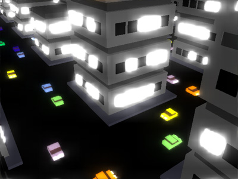

# Frogzilla

The Fuzzion 4k intro *Frogzilla* (2004, Euskal Encounter XII), and its ports.

## Layout

    common/          everything that is not specific to one platform
      data/          the demo's content: module, instruments, camera arrangement
      doc/           what the intro does, and how its player and synth work
      reference/     the original 2004 releases, and the .it they came from
      tools/         frame comparison, contact sheets, the float-literal filter
    ports/
      win32/         the original, as it stood in December 2004
      macos-x86_64/  Intel macOS: CGL, CoreAudio, CoreText
      webgl/         the browser: WebGL 2, Web Audio, no build step
    packers/
      onekpaq64/     64-bit port of the oneKpaq decompressor, for any x86-64 port

## What is genuinely shared

`common/data/` is the source of truth for the intro's *content*, and both
existing ports assemble the same files:

| file | what it is |
|---|---|
| `zik.asm` | the module: order list, patterns, channels |
| `samples.inc` | parameters for the eight generated instruments |
| `cameras.inc` | which camera is live during each slice of the timeline |

These are NASM `db`/`dw` tables, so an ARM port will need to convert them
rather than include them. The values are what matters, and they are documented
in `common/doc/effects.md`.

`cameras.inc` is the one file that is not literally what the original held: the
2004 `cameratable.inc` was a jump table of `dw _main.cameraN`, which is a Win32
code artefact rather than data. The arrangement itself is now a list of `CAM n`
lines, and each port defines `CAM` — the Win32 tree expands it back to the same
jump-table entries, byte for byte.

Everything above that line is per-port: the arithmetic is the same everywhere,
but the code is not portable — x87 on Intel, and the platform layer differs
completely.

## Building

Each port builds independently, from its own directory.

    cd ports/macos-x86_64 && make        # -> ./frogzilla, a 6389-byte Mach-O
    cd ports/win32/src    && build.bat   # needs DOS/Windows and nasm on the PATH

`ports/webgl/` has no build: it is ES modules, served as they are. `make serve`
prints the URL. `make bundle` flattens it into a single `build/frogzilla.html`
that opens by double-clicking, and `make pack` minifies and roadrolls that down
to a ~25 KB self-contained page. `make verify` renders the same thirteen frames
the macOS port does and compares them; `make audio` mixes the tune in node and
compares it with `song.wav`.

## A note on the Win32 tree

`ports/win32/` is the December 2004 source, unchanged apart from three things:
it takes its data tables from `common/data/`, `R.BAT` became `build.bat`
pointing at them, and the intermediate files that `fuxnasm` produces now go to
`../build/` instead of an `output/` directory beside the sources. Files that
were in the working directory but never assembled — `blocks.asm`, `muzik.inc`
(the module from a different intro), `gdiOrdinal_matxembrat.inc` — were left
out, as were the third-party binaries that sat beside them: `nasmw.exe`,
`apack.exe` and `writer.com`. `fuxnasm.exe` is kept, because it is the crew's
own tool and nothing else does what it does.

Assembled with a modern NASM, the tree produces a 25085-byte `intro.exe`, which
is the same size as the 2004 binary and byte-identical to what the untouched
2004 tree produces with that same assembler. It differs from the 2004 binary in
about 2000 bytes: NASM has changed how it sizes some branches since 0.98, and
the code shifts by three bytes early on. **This has not been re-tested on
Windows.**

`common/tools/fuxnasm.py` is a stand-in for `fuxnasm.exe`, the DOS filter that
rewrites `#1.0#` into the float's bit pattern, so the Win32 tree can be
assembled and checked from a Unix machine. Its output is byte-identical to the
original filter's on these sources.

## Credits

Original intro by **Fuzzion**, 2004 — code by pain, bp and ufix, music by
wonder, module tools by ccm, packed with 20to4. Released at Euskal Encounter
XII. The ports keep the original data intact.

**Port to macOS x86_64 & WebGL done with heavy usage of Claude**.
